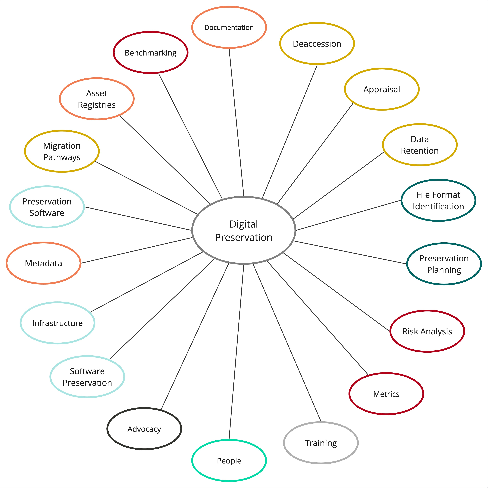

# Digital Preservation Overview
Last updated: 2026-01-30

## What is Digital Preservation?

>“A series of managed **activities** necessary to ensure continued **access** to digital materials for as **long as necessary.** Digital preservation … refers to all of the actions required to maintain access to digital materials beyond the limits of **media failure** or **technological and organisational change.**”  
>-Digital Preservation Coalition

## Digital Preservation Activities
The image below provides and overview of a select digital preservation activities undertaken by the Service.

  

Some of the basic digital preservation activities include:

|Activity|Description|
|:-------|:----------|
|Planning and Documentation|Planning and documentation are key components of a digital preservation program. Digital preservation planning can include risk analysis, program benchmarking, and format strategies. Documentation can include digital preservation policies, frameworks, and workflows.|
|Metadata|Metadata is information that provides context about the digital files. Metadata for digital preservation includes information needed to manage the digital files over time. This information can be contextual, historical or technical in nature.|
|Fixity Checking|Fixity checking is a method that involves verifying that the file has not been altered or changed. This ensures that the integrity of the file is maintained. A common way to conduct fixity checking is to use checksums, a unique alpha-numerical sequence, that identifies the file.|
|Refreshing|Refreshing is a method that involves copying digital content from one storage medium to another storage medium of the same type. During this process there is no change to the bitstream of the file. Storage media refresh needs to occur to address storage decay or obsolescence. It is one component of a successful digital preservation program.|
|Replication|Replication is a method that involves ensuring that multiple copies of the digital files are stored in different geographic locations to mitigate loss in the event of a disaster, (fire, flood, system failures, cyberattack, etc.)|
|Migration|Migration involves transforming data from one format to a newer version of the same format. It may also involve the migration of a file to a different format to ensure continued access.|
|Normalization| Normalization involves converting copies of the original files to a select few non-propriety and widely available and used formats.|

- [Digital Preservation Basics](https://drive.google.com/file/d/1BfVPpTKyV3LhmzTHb-vmVDHjQbO_SMFy/view?usp=drive_link) (PDF 276 KB)