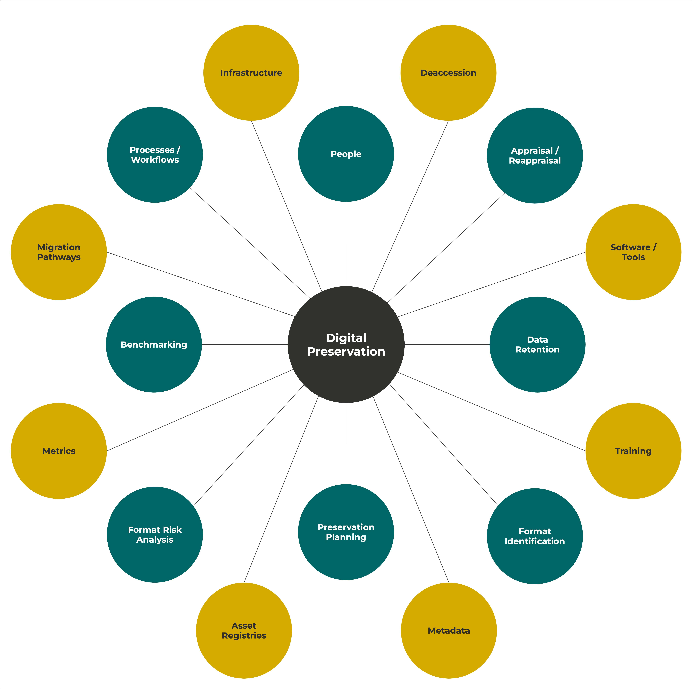

# Digital Preservation Overview
Last updated: 2026-05-27

## What is Digital Preservation?

>“A series of managed **activities** necessary to ensure continued **access** to digital materials for as **long as necessary.** Digital preservation … refers to all of the actions required to maintain access to digital materials beyond the limits of **media failure** or **technological and organisational change.**”  
>-Digital Preservation Coalition

## Digital Preservation Activities
The image below provides and overview of select digital preservation activities undertaken by the Service.

  

- Click to enlarge image

---
Examples of activities undertaken by Digital Preservation Services include:

|Activity|Examples|
|:-------|:------|
|Asset Registry|Inventory of all preservation packages.|
|Benchmarking| Using [DPC RAM Benchmarking](https://www.dpconline.org/digipres/implement-digipres/dpc-ram) to evaluation the Service.|
|Documentation|Documenting workflows and storage infrastructure.|
|Format Identification|Format analysis and development of format signatures for [PRONOM](https://www.nationalarchives.gov.uk/PRONOM/Format/proFormatSearch.aspx?status=new)|
|Metrics|Collecting information about processing, appraisal decisions, and format identification.|
|Outreach and Advocacy|Delivering presentations about digital preservation and Digital Preservation Services, and the development of resources for the digital preservation community and researchers.|
|Preservation Planning|Developing a Preservation Action Planning and Risk Matrix that will be made public via the Services' [Format Policy Registry](https://github.com/frdr-dfdr/pres_res_fpr).|