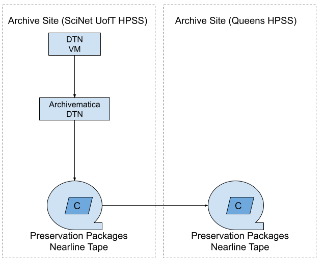

# High Level Workflows
Last updated: 2026-02-06

## Processing Workflows
Includes workflows related to the processing of datasets for long-term preservation.

Click to enlarge image
### Dataset processing workflow

 

[Digital Preservation Processing Workflow](https://drive.google.com/file/d/1ky841BrbpAwlt7SoLNsD7Ac4sXtNFjKL/view?usp=drive_link) (PDF 460 KB)

1. Dataset is published.
2. Jira task is cloned.
3. Jira task moves to `FPRES Jira board`.
4. Task is moved to `File Listing` status.
5. A file list is created and the task moves to the `Appraisal Queue`.
6. An appraisal decision is made. If the dataset is rejected for long-term preservation that the Jira task is marked as `Done`. If the dataset is accepted for long-term preservation the Jira task moves to the `Queued for Preservation` status.
7. Once there is capacity on the Digital Preservation Service Team, the Jira task associated with the dataset will move to the `Preservation Processing` status and preservation preparation activities are started.
8. Dataset goes through full preervation processing and a preservation package is created.
9. Jira task moves to `Archival Storage` status.
10. Preservation Package is transfered to SciNet for long-term storage.
11. Metadata is entered into `FRDR` and the `AIP Inventory` sheet.
12. `METS` and `Pointer Files` are exported and stored in the Digital Preservation Services storage area.
13. Jira task is marked as `Done`.

## Format Related Workflows
Includes all format related workflows from identification to the updating of the Format Policy Registry.

Click to enlarge image

### File Listing Generation - DRAFT

[File Listing Workflow](https://drive.google.com/file/d/10amOasg-hfKwbXzrjBrUER4PREhf1m4m/view?usp=drive_link) (PDF 1.6 MB) - DRAFT

### Format Identification and Signature Development

[Format Signature Development Workflow](https://drive.google.com/file/d/17rKpy0tFV2vNNC_-qlljs8MRHIyMRHAA/view?usp=drive_link) (PDF 912 KB)

1. Get format report.
2. Get list of unknown formats.
3. Research formats.
4. Source file samples.
5. Analyze the file hex information.
6. Develop a signature.
7. Test signature with `DROID` and `Siegfried`.
8. If signature testing is successful, then submit the signature to PRONOM for inclusion
9. If signature is unsuccessful, the reach out to the community or attend a PRONOM drop-in meeting. 
10. Return to step 3.

### Format Policy Registry Update

[Format Policy Registry Update](https://drive.google.com/file/d/1aQk3wPv-HiVA2YAJYbPOvLFWCvqEp9vi/view?usp=drive_link) (PDF 1.2 MB) 

1. Create a file listing using Siegfried that includes all files in the dataset, the file path, the MIME type, and the format if known.
2. Add the dataset file listing to the full dataset range CSV.
3. Run the full CSV through scripts. 
4. The script will find all unique formats and calculate the number of times the format is in the CSV.
5. Investigate unknown formats.
6. Update the CSV list with the format identification information
7. Add formats to `Digital Preservation Action Plan`.
8. Download the the full list from the `Digital Preservation Action Plan` and format stats CSV.
9. Move old Format Policy Registries to Google Drive for storage (automated).
10. Run format stats and the `Digital Preservation Action Plan` through scripts to create CSVs, markdown.
11. Generate French copy.
12. Commit and push changes to GitHub repository.

## Storage Infrastructure Diagram

[Long-Term Storage Diagram](https://drive.google.com/file/d/18UzP-n54UvHaTZeeTCX3RzgZhlFP1COb/view?usp=drive_link) (PDF 117 KB)

1. Datasets get moved from repository storage to Archivematica proccessing pipeline ingest area
2. Preservation packages are generated
3. Preservation packages are transferred to SciNet for long-term storage
4. Backup copies are stored at Queens University
