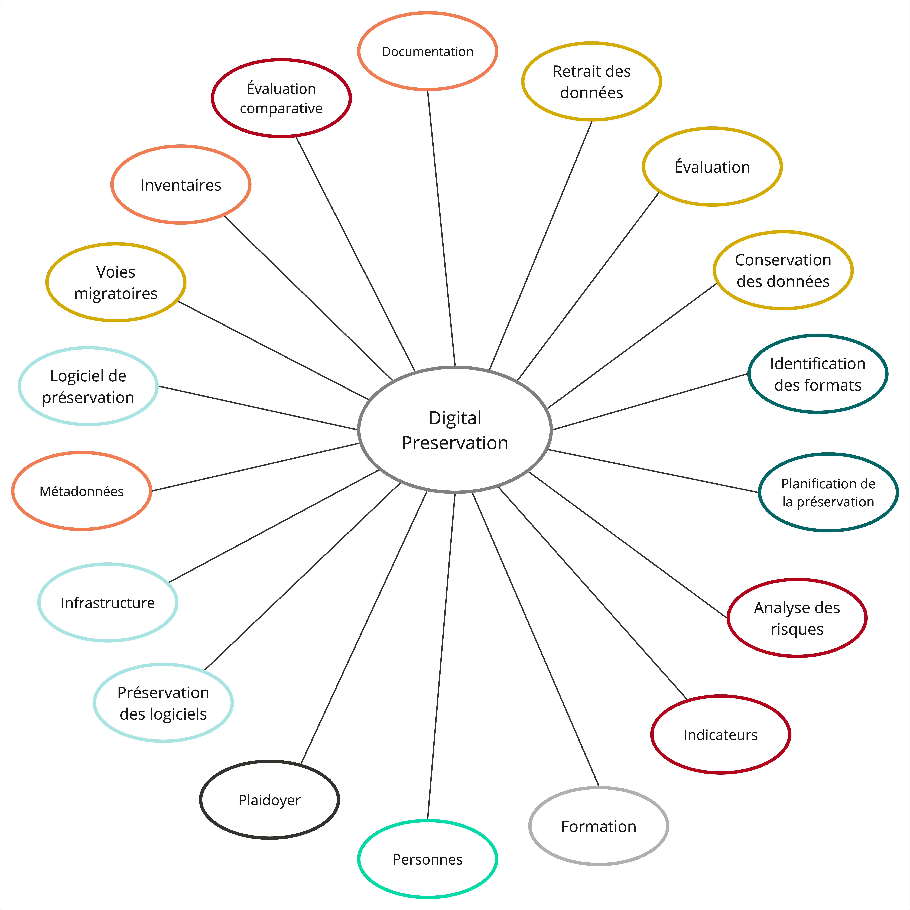

# Aperçu de la préservation numérique
Dernière mise à jour : 2026-01-28

## Qu'est-ce que la préservation ?
>« Une série **d'activités** gérées nécessaires pour garantir un **accès** continu aux objets numériques **aussi longtemps que nécessaire.** La préservation numérique …  fait référence à toutes les actions nécessaires pour maintenir l'accès aux objets numériques au-delà des limites de la **défaillance des médias** ou des **changements technologiques et organisationnels.** »  
>-Digital Preservation Coalition

## Activités de préservation numérique
L'image ci-dessous donne un aperçu d'une sélection d'activités de préservation numérique menées par le Service.

  

- Cliquez pour agrandir l'image

Certaines des activités fondamentales de préservation numérique comprennent :

