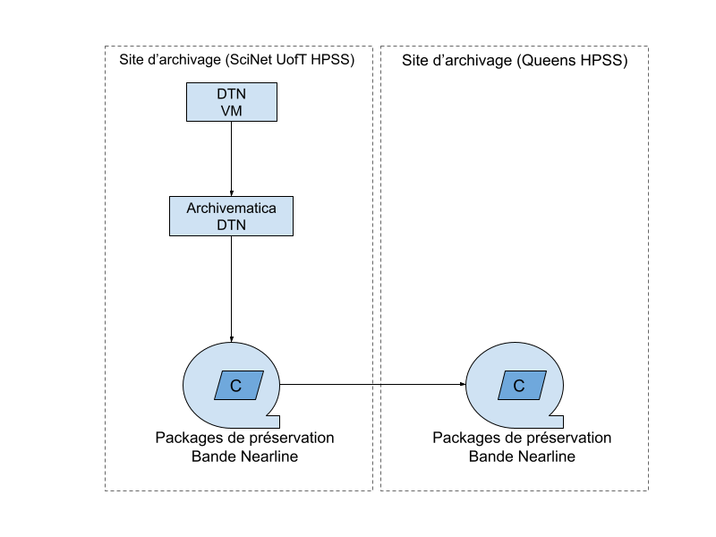

# Flux de travail et diagrammes de haut niveau
Dernière mise à jour : 2026-02-07

## Flux de travail de traitement
Comprend les flux de travail liés au traitement des jeux de données en vue de leur préservation à long terme.

Cliquez pour agrandir l'image

### Flux de travail pour le traitement des jeux de données

 

[Flux de travail pour le traitement des jeux de données](https://drive.google.com/file/d/1f5n4hFFm9nqOl9tZIGgdvu0YH-aQOaOr/view?usp=sharing) (PDF 1.2 MB)

1. Le jeu de données est publié.
2. La tâche Jira est clonée.
3. La tâche Jira est déplacée vers le tableau `FPRES Jira`.
4. La tâche passe au statut `Liste des fichiers`.
5. Une liste de fichiers est créée et la tâche passe à la `File d'attente d'évaluation`.
6. Une décision d'évaluation est prise. Si le jeu de données est rejeté pour la préservation à long terme, la tâche Jira est marquée comme `Terminée`. Si le jeu de données est accepté pour la préservation à long terme, la tâche Jira passe au statut `En attente de préservation`.
7. Dès que l'équipe du service de préservation numérique dispose de la capacité nécessaire, la tâche Jira associée au jeu de données passe au statut `Traitement de préservation` et les activités de préparation à la préservation sont lancées.
8. Le jeu de données est soumis à un traitement de préservation complet et un paquet de préservation est créé.
9. La tâche Jira passe au statut `Stockage d'archives`.
10. Le paquet de préservation est transféré vers SciNet pour le stockage à long terme.
11. Les métadonnées sont saisies dans le `DFDR` et dans la feuille `Inventaire AIP`.
12. Les fichiers `METS` et `Pointer` sont exportés et stockés dans la zone de stockage des services de préservation numérique.
13. La tâche Jira est marquée comme `terminée`.

## Flux de travail liés au format
Comprend tous les flux de travail liés au format, depuis l'identification jusqu'à la mise à jour du registre des politiques de format.

Cliquez pour agrandir l'image

### Génération de listes de fichiers - ÉBAUCHE

[Flux de travail pour la liste des fichiers](https://drive.google.com/file/d/1ydXZrJleKEPLdsbvka59M_khY4HOKgxS/view?usp=drive_link) (PDF 1.6 MB)

### Identification du format et développement de la signature

[Identification du format et développement de la signature](https://drive.google.com/file/d/13uW0B8ev5xYmrDZCYUuDIm_aG8ln1VxQ/view?usp=drive_link) (PDF 931 KB)

1. Obtenir le rapport sur les formats.
2. Obtenir la liste des formats inconnus.
3. Rechercher les formats.
4. Trouver des exemples de fichiers sources.
5. Analyser les informations hexadécimales du fichier.
6. Développer une signature.
7. Tester la signature avec `DROID` et `Siegfried`.
8. Si le test de signature est concluant, soumettre la signature à PRONOM pour inclusion.
9. Si la signature n'est pas concluante, contacter la communauté ou participer à une réunion PRONOM. 
10. Revenir à l'étape 3.

### Mise à jour du registre des politiques de format

[Mise à jour du registre des politiques de format](https://drive.google.com/file/d/1ik4SAW90eUvwtY_d0HU2F-2yEqPz5e9s/view?usp=drive_link) (PDF 1.1 MB)

1. Créez une liste de fichiers à l'aide de Siegfried qui inclut tous les fichiers du jeu de données, le chemin d'accès au fichier, le type MIME et le format s'il est connu.
2. Ajoutez la liste des fichiers du jeu de données au CSV complet du jeu de données.
3. Exécutez le CSV complet à l'aide de scripts. 
4. Le script trouvera tous les formats uniques et calculera le nombre de fois où le format apparaît dans le CSV.
5. Examinez les formats inconnus.
6. Mettre à jour la liste CSV avec les informations d'identification des formats.
7. Ajouter les formats au `Plan d'action pour la préservation numérique`.
8. Télécharger la liste complète à partir du `Plan d'action pour la préservation numérique` et du fichier CSV contenant les statistiques sur les formats.
9. Déplacer les anciens registres de politiques de format vers Google Drive pour les stocker (automatisé).
10. Exécuter les statistiques sur les formats et le `Plan d'action pour la préservation numérique` à l'aide de scripts afin de créer des fichiers CSV et des markdowns.
11. Générer une copie en français.
12. Valider et envoyer les modifications au dépôt GitHub.

## Schéma de l'infrastructure de stockage

[Schéma de stockage à long terme](https://drive.google.com/file/d/1jlj6JuSqqgseiX4HO2V8IJfuSLtondIC/view?usp=drive_link) (PDF 25 KB)

1. Les jeux de données sont transférés du stockage du dépôt vers la zone d'ingestion de traitement d'Archivematica.
2. Des paquets de préservation sont générés.
3. Les paquets de préservation sont transférés vers SciNet pour un stockage à long terme.
4. Des copies de sauvegarde sont stockées à l'université Queens.
